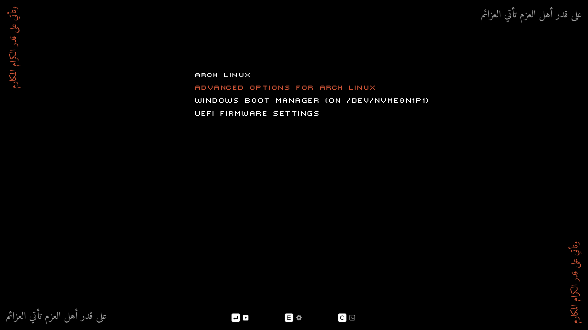
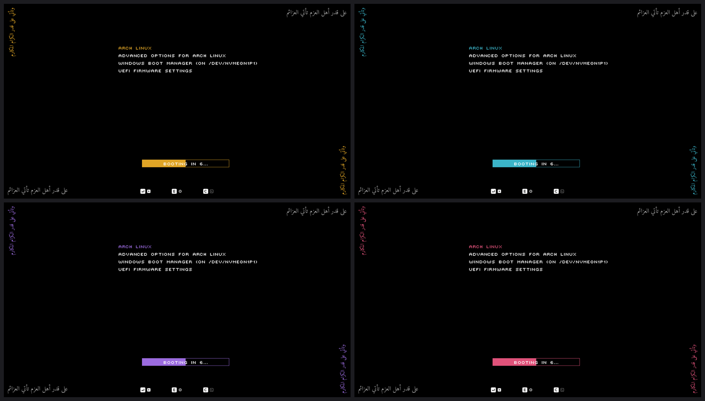
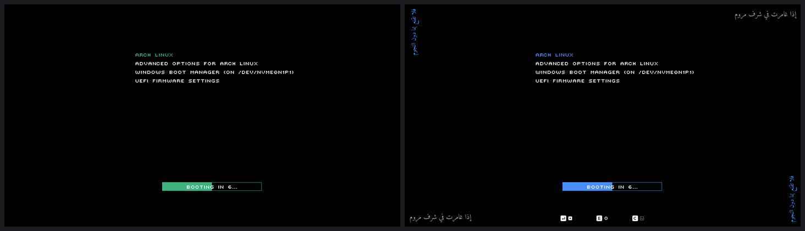
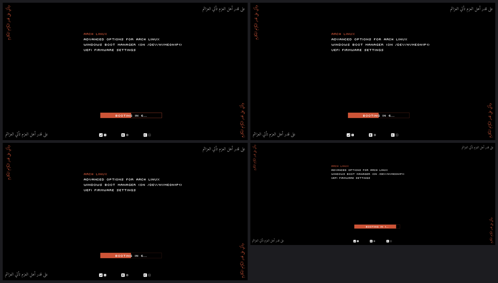

<div align="center">


# Najm

**A dark, pixel-font GRUB theme with Arabic verses in the corners.**
Looks right from 1024×768 up to 4K and ultrawide.

[](LICENSE)
[](https://www.gnu.org/software/grub/)
[](https://github.com/najm-labs/grub-theme/stargazers)



[Install](#install) · [Options](#options) · [Previews](#previews) · [Distros](#does-it-work-on-my-distro) · [Troubleshooting](#troubleshooting)

</div>

Every screenshot here is a real GRUB 2.12 running in QEMU, not a mock-up.
## Features

- **15 ready-made resolutions.** Any other `WxH` is generated when you ask for it. Layout, decorations and font scale together.
- **Customise at install time.** Accent colour, verses (five classical presets or your own text), the key-hint bar, the countdown bar and the menu timeout.
- **One installer for most distros.** It finds `/boot/grub` or `/boot/grub2`, `grub-mkconfig` or `grub2-mkconfig`, and your screen's native resolution.
- **Easy to undo.** It backs up `/etc/default/grub`, only edits its own marked block, rolls back if `grub-mkconfig` fails, and `--uninstall` restores your file exactly.
- **No dependencies for the default look.** Python and Pillow are only needed if you customise, and the installer can fetch them into a throw-away virtualenv.

## Install

```sh
git clone https://github.com/najm-labs/grub-theme.git
cd grub-theme
sudo ./install.sh
```

In a terminal this opens a short wizard (resolution, colour, verses, extras, timeout). Reboot when it's done.

For scripts and dotfiles, skip the prompts:

```sh
sudo ./install.sh -y                                   # detect resolution, default look
sudo ./install.sh -y -r 2560x1440 --accent cyan --verse stars --timeout 5
sudo ./install.sh -y --no-verses --no-hints            # minimal: menu + countdown only
sudo ./install.sh --dry-run                            # show what would happen
sudo ./install.sh --uninstall
```

You need `bash` and GRUB 2 as your bootloader. On Alpine: `apk add bash`.

### Options

| Option | What it does |
| --- | --- |
| `-r, --resolution WxH` | Screen resolution. Default: detected from the connected monitor. |
| `--accent NAME\|#RRGGBB` | `najm` (default), `gold`, `green`, `cyan`, `blue`, `violet`, `rose`, `white`, or any hex colour. |
| `--verse ID` | `najm` (default), `ships`, `stars`, `dunya`, `qadar`. Run `./install.sh --list-verses` to see them. |
| `--vertical TEXT` `--horizontal TEXT` | Your own Arabic text. Give both. |
| `--no-verses` `--no-hints` `--no-countdown` | Drop the corner verses, the Enter/E/C hint bar, or the countdown bar. |
| `--timeout N` | Sets `GRUB_TIMEOUT`. |
| `--show-menu` | Always show the menu (Ubuntu hides it by default). |
| `--name NAME` | Theme directory name. Default: `najm`. |
| `--themes-dir`, `--grub-cfg` | Override the detected paths. |
| `--no-regenerate` | Edit files but skip `grub-mkconfig`. |
| `--export DIR` | Only write the finished theme to `DIR`. For NixOS, packaging and manual installs. |
| `--detect` | Print what was detected on your machine. Paste this in bug reports. |
| `-y, --yes` / `--dry-run` / `--no-pip` | No prompts / change nothing / never use pip. |

## Previews

**Accent colours**



**Layouts and verses.** Minimal layout on the left, another verse with the blue accent on the right.



**Scaling.** 1280×720, 2560×1440, 3840×2160 and 3440×1440 ultrawide, all drawn at the same width.



## Resolutions

Ready-made:

`1024x768` `1280x720` `1280x800` `1280x1024` `1366x768` `1440x900` `1600x900` `1680x1050` `1920x1080` `1920x1200` `2560x1080` `2560x1440` `2560x1600` `3440x1440` `3840x2160`

Anything else (say `1600x1200`) is generated on the spot if Pillow is available. Without Pillow, the installer uses the closest ready-made theme and still sets GRUB to your resolution.

`GRUB_GFXMODE` is set to `<res>x32,<res>,auto`. If the firmware doesn't offer that mode, GRUB falls back to `auto` and the theme still works, just not pixel-matched.

> [!NOTE]
> Some BIOS (VBE) setups don't offer modes like 1366×768. The QEMU BIOS used for these previews is one of them. UEFI normally offers the panel's native mode.

## Does it work on my distro?

GRUB lives in different places depending on the distro. The installer handles that.

| Family | GRUB files | Regenerate with |
| --- | --- | --- |
| Debian, Ubuntu, Mint, Pop!_OS, Arch, Manjaro, EndeavourOS, Gentoo, Void, Alpine | `/boot/grub` | `grub-mkconfig` |
| Fedora, RHEL, Alma, Rocky, CentOS Stream, openSUSE | `/boot/grub2` | `grub2-mkconfig` |
| RHEL 8-style UEFI | also the real `grub.cfg` on the ESP | detected and regenerated too |
| NixOS | declarative | refused with instructions, use `--export` |
| systemd-boot, rEFInd, Limine | not GRUB | not supported |

**What has actually been tested:**

- Rendering in real GRUB under QEMU, BIOS and UEFI.
- A real `grub-mkconfig` run against an Ubuntu 24.04 userland.
- The installer's logic on staged Debian/Ubuntu, Fedora and RHEL-style directory layouts (`tests/test_install.sh`).

Other distros follow the same conventions but haven't been run on real installs. If something is off, open an issue and include the output of `./install.sh --detect`.

Ubuntu-style `/etc/default/grub.d/*.cfg` drop-ins are read later and can override `GRUB_THEME`, `GRUB_TERMINAL` or `GRUB_GFXMODE`. If any of them set those, the installer warns you.

## How it works

The installer copies a theme directory to `/boot/grub{,2}/themes/najm/` and appends this block to `/etc/default/grub`:

```sh
# >>> najm-grub-theme >>>
GRUB_THEME="/boot/grub/themes/najm/theme.txt"
GRUB_GFXMODE="1920x1080x32,1920x1080,auto"
GRUB_GFXPAYLOAD_LINUX=keep
unset GRUB_TERMINAL GRUB_TERMINAL_OUTPUT   # themes need the graphical terminal
# <<< najm-grub-theme <<<
```

Then it runs `grub-mkconfig`, which adds a `loadfont` line for every `.pf2` font in the theme folder and sets `theme`. Your own lines are never touched. `--uninstall` removes the block and the theme folder.

GRUB can't shape Arabic text, so the verses are pre-rendered PNGs with proper joining and right-to-left order. The menu font is a PF2 bitmap font, and `tools/pf2.py` can redraw it at any integer pixel size. That's how large screens get a crisp font at the right size.

<details>
<summary><b>Manual install</b></summary>

<br>

```sh
sudo cp -r themes/1920x1080 /boot/grub/themes/najm      # /boot/grub2 on Fedora/openSUSE
# add GRUB_THEME and GRUB_GFXMODE to /etc/default/grub, and remove GRUB_TERMINAL=console
sudo grub-mkconfig -o /boot/grub/grub.cfg                # grub2-mkconfig on Fedora/openSUSE
```

If you write `grub.cfg` by hand, it needs a `loadfont` for the theme's `.pf2` file. `grub-mkconfig` does this for you.

</details>

## Troubleshooting

<details>
<summary><b>I don't see the theme at boot</b></summary>

<br>

Many distros hide the menu (`GRUB_TIMEOUT_STYLE=hidden` or `GRUB_TIMEOUT=0`). Hold <kbd>Shift</kbd> (BIOS) or tap <kbd>Esc</kbd> (UEFI) while booting, or re-run the installer with `--show-menu`.

</details>

<details>
<summary><b><code>error: ... bitmap file ... is of unsupported format</code></b></summary>

<br>

A theme file points to an empty or non-image path, for example `desktop-image: ""`. The installer checks for this. If you edited `theme.txt` yourself, delete the empty line.

</details>

<details>
<summary><b>Text is tiny or in the wrong font</b></summary>

<br>

The `.pf2` file wasn't loaded. Regenerate with `grub-mkconfig`; copying the files isn't enough.

</details>

<details>
<summary><b>GRUB is stuck at 640×480 or 800×600</b></summary>

<br>

The firmware doesn't offer your mode. At the GRUB prompt (<kbd>c</kbd>), run `videoinfo` to see which ones it does.

</details>

<details>
<summary><b>Black screen right after choosing a kernel</b></summary>

<br>

Remove `GRUB_GFXPAYLOAD_LINUX=keep` from the managed block and re-run `grub-mkconfig`.

</details>

<details>
<summary><b><code>/boot</code> is on its own or an encrypted partition</b></summary>

<br>

That's fine as long as GRUB can read it. The theme lives under `/boot`, so it goes wherever `/boot` goes.

</details>

## Building from source

```sh
pip install pillow                            # plus arabic-reshaper python-bidi if Pillow lacks libraqm
./build.py --all                              # rebuild themes/
./build.py -r 2560x1440 --accent "#3BB4C8" --verse ships -o out/
./build.py -r 1920x1080 --vertical "..." --horizontal "..." -o out/
tests/test_install.sh                         # installer tests, no real GRUB touched
tools/preview.py themes/1920x1080 -r 1920x1080 -o shot.png   # real GRUB in QEMU (--uefi for UEFI)
```

Previews need `grub-mkrescue` (plus `grub-pc-bin`, and `grub-efi-amd64-bin` for `--uefi`), `xorriso`, `mtools`, `qemu-system-x86_64`, and `ovmf` for `--uefi`.

Repo layout:

| Path | Contents |
| --- | --- |
| `build.py` | theme generator |
| `install.sh` | installer |
| `themes/` | pre-built themes |
| `data/` | resolutions, accents, verses |
| `assets/fonts/` | fonts |
| `tools/` | PF2 library, preview script |
| `tests/` | installer tests |

## AI use

I used AI to help write this README and some of the Python scripts (`build.py`, `tools/`).

## Credits

- Verses: al-Mutanabbi (`najm`, `ships`, `stars`), Ahmed Shawqi (`dunya`), Abu al-Qasim al-Shabbi (`qadar`).
- Arabic text is set in [Amiri](https://github.com/aliftype/amiri) (SIL OFL 1.1).
- Font licences: [assets/fonts/NOTICE.md](assets/fonts/NOTICE.md).

## License

[MIT](LICENSE). Third-party fonts keep their own licences.
